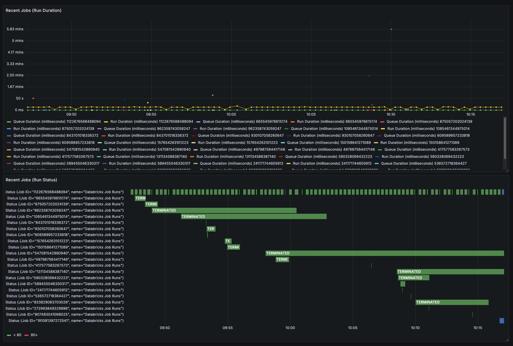

# Grafana Databricks Observability Plugin

A Grafana plugin for visualizing Databricks resources directly in your dashboards. Query and visualize information about job runs and pipelines from your Databricks workspace.

## Features

- Job Runs: Visualize your Databricks job executions, including run status, duration, and other metrics
- Pipelines: Query data about your Databricks Delta Live Tables pipelines
- Filtering Options: Flexible filtering by job ID, run type, and execution status

## Installation

You can install the plugin from the Grafana Marketplace (`Databricks Community`) or build it from source.

## Pre-requisites

- Grafana `9.0` or later
- Databricks workspace (any cloud provider)
- Databricks Service Principal with the following permissions:
  - Permissions to list either all or specific jobs / pipelines, **or**:
  - Admin permissions in the workspace

## Configuration

1. In Grafana, navigate to `Configuration > Data Sources > Add data source`
2. Search for "Databricks Community" and select this plugin
3. Configure the following settings:
  - `Workspace URL`: Your Databricks workspace URL (e.g., https://adb-xxx.0.azuredatabricks.net)
  - `Client ID`: Service Principal Client ID
  - `Client Secret`: Service Principal Client Secret
4. Click "Save & Test" to verify the connection

## Supported Data Sources

The query editor provides different options based on the selected resource type:

### Job Runs

- `Job ID`: Optional filter to show runs for a specific job
- `Active Only`: Toggle to show only currently running jobs
- `Completed Only`: Toggle to show only completed jobs
- `Run Type`: Filter by job run type (JOB_RUN, WORKFLOW_RUN, or SUBMIT_RUN)
- `Max Results`: Maximum number of results to return (default: 200)

### Pipelines

- `Filter`: Text filter for pipeline queries
- `Max Results`: Maximum number of results to return (default: 200)

## Example Dashboards

Please refer to the [dashboards](./dashboards) directory for example dashboards that demonstrate the capabilities of this plugin.
